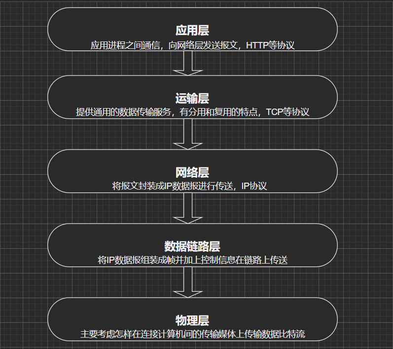

# 
一、计算机网络概述
## 1.1、计算机网络的概念
* 计算机网络是一个将分散的计算机通过设备与线路连接起来以实现`资源共享`和`信息传递`的系统，强调部分是计算机网络的两个最重要的特点，有时也称为：`连通性`和`共享`;
* 简单来说就是一些互联的、自治的计算机系统的集合；
* 计算机网络由若干结点和链路组成；
* 不同网络之间通过路由器相连，形成“网络的网络”；
* 互联网（Internet，首字母大写，是专有名词）是目前世界上最大的计算机网络；
## *1.2、计算机网络的三个阶段
> 第一阶段：由单个的ARPANET向互连网的发展
* ARPANET即为美国的阿帕网，最初只是一个单一的分组交换网，是互联网的雏形；
* 这一阶段制定了TCP/IP协议；
> 第二阶段：建成了三级结构的互联网
* 三级范围分为：主干网、地区网、校园网（或企业网）；
* 代表的有：美国的NSFNET(国家基金会网)；
> 第三阶段：多层次的ISP结构的互联网
* ISP即为互联网服务提供商，如中国电信；
* ISP从互联网管理机构申请IP地址，建造通讯设备和线路，个人或组织向ISP付费以获取IP的使用权，从而“上网”；
* ISP的层次：主干ISP、地区ISP和本地ISP，以及在地区ISP间连接的IXP(互联网交换点，使地区之间通过高速链路对等交换，通讯更快速)；
## 1.3、计算机网络的组成
> 从传统意义的组成来看
* 一个计算机网络主要由硬件、软件和协议组成；     
* 硬件：主机(host)、链路(link，如光纤)、结点(node,如路由器)以及信息处理设备(如网卡、CPU);
* 软件： 各种通信软件（微信、qq）;       
* 协议：这是核心部分，如同交通规则，常见的协议如TCP/IP；      
> 从工作方式看
* 由边缘部分和核心部分组成
* 边缘部分：用户的主机或端系统、也可以是服务器；
* 核心部分：大量的网络和路由结点，为边缘部分提供服务；    
## *1.4、计算机网络的分类
> 按网络作用的范围分类
* 广域网(WAN)
* 城域网(MAN，这部分有时也算如局域网)
* 局域网(LAN)
* 个人局域网(PAN)
> 按使用者分类
* 公用网
* 专用网
> 按交换技术分类
* 电路交换(传统的电话网络，两个用户占有一条专线)
* 报文交换(如电报通信或者邮局通信，将用户数据加上源地址、目的地址、校验码等信息封装成报文，也称存储-转发网路)
* 分组交换(将一个报文分成等长的组(也称包)，每组加上一些控制信息，通过路由进行转发分组交换)
## 1.5、衡量计算机网络的指标
* 速率：就是通常认知的网速，即数据的传送速率，数据的基本量的bit(位)，速率的单位即是bit/s(或bps)及其更高的单位换算
* 带宽：通讯信号具有的频带宽度(最高和最低频率的差)，单位是Hz，及其单位换算；传统意义的带宽即指最高数据率
* 吞吐量：单位时间内通过某网络的数据量
* 时延(delay)：有发送时延(数据从端系统发送数据到网络)、传输时延(数据流在网络的链路里里面传输、如在光纤里面传输)、处理时延(数据在主机或路由器里面处理)和排队时延(在路由器的输入队列里面等待)之分
* 时延带宽积
* 往返时延等
## 1.6、计算机网络的体系结构
### 1.6.1、两种标准
* 法律上的国际标准是国际标准组织ISO的OSI(开放系统互联基本参考模型)标准，规定网络有七层结构(分别是应用层】表示层、会话层、运输层、网络层、数据链路层、物理层)；
* 事实上的国际标准是TCP/IP,具有四层结构(应用层、运输层、网际层、网络接口层);
> 学习时常常将上面两种标准综合起来，形成具有五层标准的计算机网络体系结构，下面介绍。
### 1.6.2、五层结构的体系结构
    
* 应用层：是体系结构中的最高层，通过应用进程来完成特定网络应用，该层的协议主要规定了`应用进程间通信和交互的规则`，如DNS、HTTP等；该层的数据单元称为`报文`;
* 运输层：向两台主机进程之间的通信提供`通用的`数据传输服务，并为上一级传送`报文`，有`复用`(多个应用层进程使用运输层提供的服务)和`分用`(把收到的下一级传上来的信息分别交付给上面的应用层进程)的功能；主要协议有：TCP(传输控制协议)、UDP(用户数据报协议)；
* 网络层：为分组交换网的不同主机提供通信服务；这一层将从运输层接收到的报文段封装成`分组`(也称包)并进行传送，由于这一层使用IP协议，所以分组也成为`IP数据报`；这一层的协议主要有：IP(网际协议)和许多路由选择协议；
* 网络链路层：将网络层交下来的IP数据报组装成`帧`，每一帧包含在链路中传输时的一些必要的控制信息；控制信息能够使接收端知道一个帧从哪个字开始和结束(如ASCII码中EOH表示帧的首部，EOT表示帧的结束，除首尾部分外的帧叫做帧的数据部分)；这一层的协议也成为规程，如封装成帧、差错检测等；
* 物理层：这一层的数据单位是bit，主要考虑怎样才能在连接各种计算机的传输媒体上传输数据比特流，主体知识主要的通信原理，如信道、带通调制以及一些传输媒介如光纤等。
## 1.7、协议与服务
* 协议是控制两个对等实体进行通信的规则，即协议是“水平的”；
* 要实现本层的协议，还需使用下一层所提供的服务；
* 在协议的控制下，两个对等实体间的通信使得本层能向上一层提供服务，服务是“垂直的”。
> 协议栈：对等实体之间通过协议通信，同时又利用协议向上一层提供服务，实现协议还得使用下一层的服务，这样各层组成的计算机网络体系结构就类似一个`栈`.